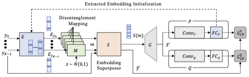
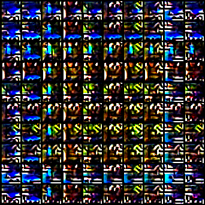

# Qimera: Data-free Quantization with Synthetic Boundary Supporting Samples

This repository is the official implementation of paper [Qimera: Data-free Quantization with Synthetic Boundary Supporting Samples]. 



## Requirements

* Python 3.6
* PyTorch 1.8.1
* Refer requirements.txt for other requirements

To install requirements:

```setup
pip install -r requirements.txt
```

## Training

For Imagenet training, change the path of the validation set in .hocon file.
To train the model described in the paper, run one of this command:

```train
./run_cifar10_4bit.sh
./run_cifar100_4bit.sh
./run_imgnet_resnet18_4bit.sh
./run_imgnet_resnet50_4bit.sh
./run_imgnet_mobilenet_v2_4bit.sh
```

Refer ```other_train_scripts``` folder for 5bit settings.

## Evaluation

To evaluate trained model, run the command below after training:

```eval
./eval_cifar10_4bit.sh
./eval_cifar100_4bit.sh
./eval_imgnet_resnet18_4bit.sh
./eval_imgnet_resnet50_4bit.sh
./eval_imgnet_mobilenet_v2_4bit.sh
```

## Visualizing Feature Space

Feature space visualization of real or synthetic images described in Figure 3.

```visualize
python experiments.py --pca_source
python experiments.py --gdfq_generator_path GENERATOR_WEIGHT_PATH --pca_gdfq --image_gdfq
python experiments.py --qimera_generator_path GENERATOR_WEIGHT_PATH --pca_qimera --pca_mix --pca_path --image_gdfq --image_mix
```


## Results

Our model achieves the following performance on :
  
| Dataset         | Model       | Teacher Net Accuracy  | 4bit Quantized Model Accuracy | 5bit Quantized Model Accuracy |
| --------------- |-------------|---------------- | -------------- |-------------- |
| Cifar-10        |  ResNet-20  |     93.89%      |     91.26%     |     93.46%    |
| Cifar-100       |  ResNet-20  |     70.33%      |     65.10%     |     69.02%    |
| ImageNet        |  ResNet-18  |     71.47%      |     63.84%     |     69.29%    |
| ImageNet        |  ResNet-50  |     77.73%      |     66.25%     |     75.32%    |
| ImageNet        | MobileNetV2 |     73.03%      |     61.62%     |     70.45%    |

Generated Synthetic Images for Cifar10 :  
</br>



## License

This project is licensed under the terms of the GNU General Public License v3.0
