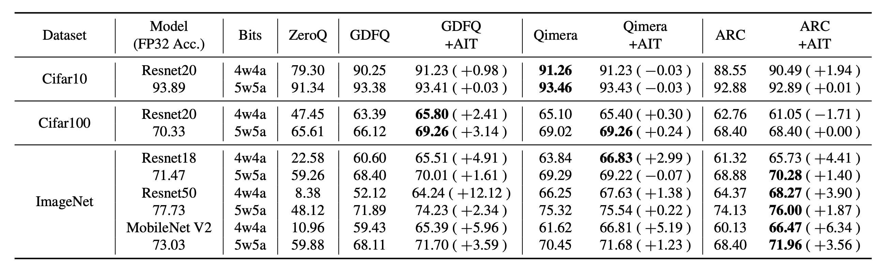

# It's All In the Teacher: Zero-Shot Quantization Brought Closer to the Teacher

This folder contains the official implementation of paper [It's All In the Teacher: Zero-Shot Quantization Brought Closer to the Teacher] on [GDFQ](https://arxiv.org/abs/2003.03603), [Qimera](https://arxiv.org/abs/2111.02625), [AutoReCon](https://arxiv.org/pdf/2105.12151.pdf) framework.



## Requirements

* Python 3.6
* PyTorch 1.10.1
* Refer requirements.txt for other requirements

## Setup

We recommend using Python virtual environment to run this code.

You can install requirements with the command below.

```setup
pip install -r requirements.txt
```

## Folder Structure

```
ait_code
├── figs
├── AutoReCon_AIT
│   ├── main.py
│   ├── optimizer.py                                # GI implementation
│   ├── option.py 
│   ├── trainer.py
│   ├── {DATASET}_{NETWORK}.hocon                   # Setting files
│   ├── run_{DATASET}_{NETWORK}_{BITWIDTH}bit.sh    # Train scripts
│   ├── trainer.py
│   └── ...                                         # Utils
├── GDFQ_AIT
│   └── ...                                         # Similar to above
├── Qimera_AIT
│   └── ...                                         # Similar to above
├── LICENSE.md
├── README.md
└── requirements.txt
```

## Training

For Imagenet training, change the path of the validation set in .hocon file.
To train the model described in the paper, run one of this command:

```train
./run_cifar10_4bit.sh
./run_cifar100_4bit.sh
./run_imgnet_resnet18_4bit.sh
./run_imgnet_resnet50_4bit.sh
./run_imgnet_mobilenet_v2_4bit.sh
```

The script name is same for all experiment framework.

## Major Arguments

* --conf_path : path to .hocon file
* --ce_scale  : coefficient of Cross-Entropy loss
* --kd_scale  : coefficient of KL-Divergence loss
* --passing_threshold : update ratio of quanized parameter per step
* --alpha_iter : GI search step limit
* --adalr : enable GI

## License

This project is licensed under the terms of the GNU General Public License v3.0
